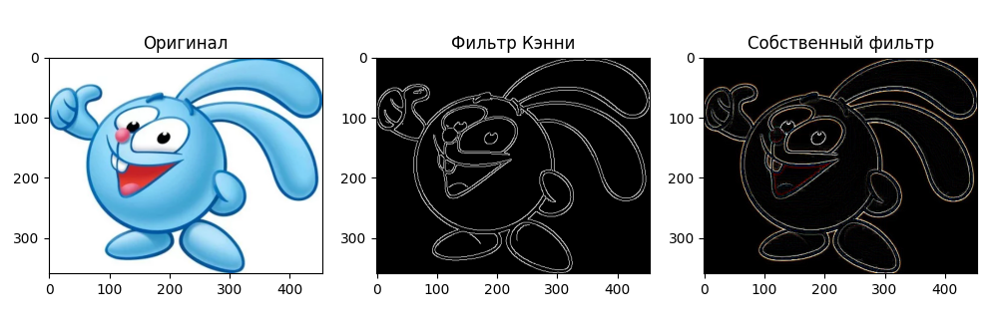
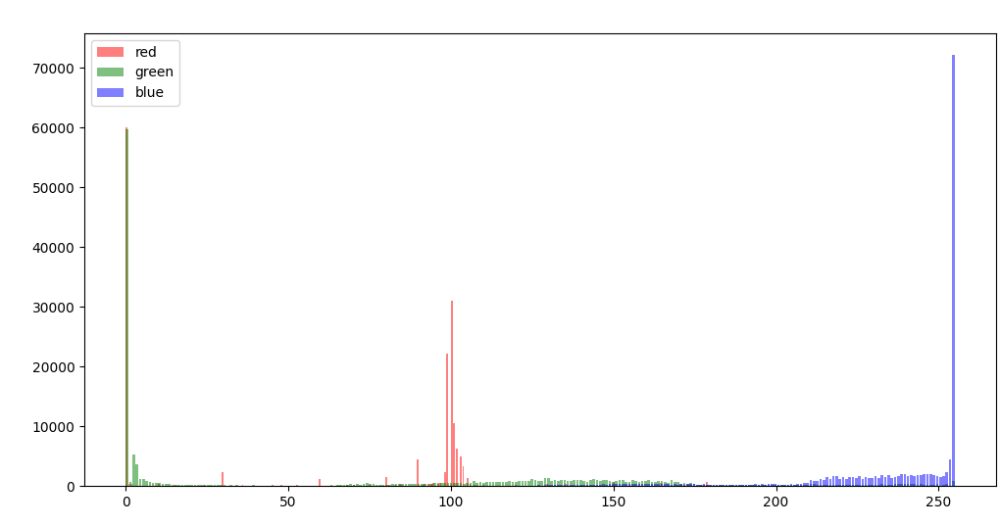
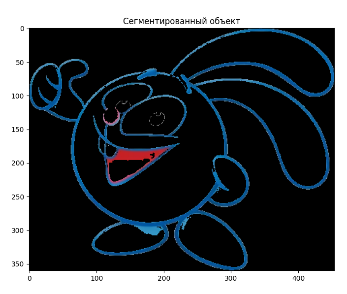
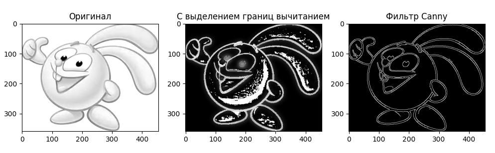
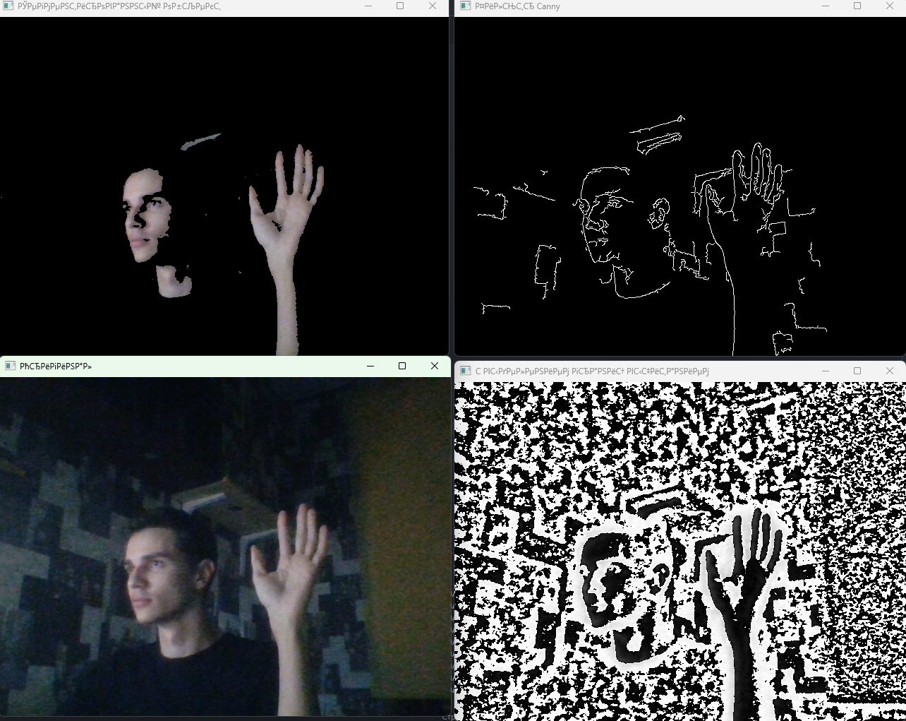

## Практическое задание 2

Собственный фильтр через инициализацию матрицы в numpy

Гистограмма изображения

Применение пороговой обработки, чтобы сегментировать контрастный объект

Сравнение фильтра с выделением границ и Кэнни

Видеопоток
